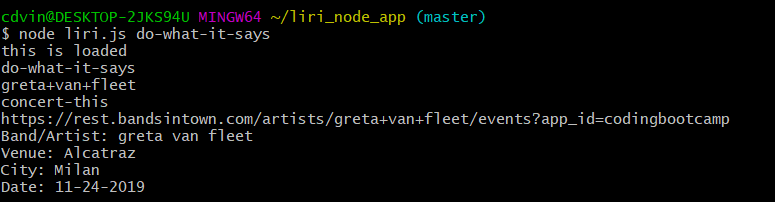
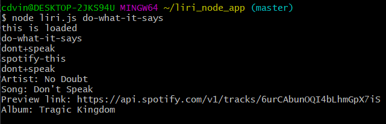

<h1>Ask LIRI</h1>

<h4>Link</h4>

https://github.com/cdvincent/Ask-LIRI

<h4>Technology Used</h4>

<ul>
    <li>Javascript</li>
    <li>Bands In Town API</li>
    <li>Spotify API</li>
    <li>OMDB API</li>
</ul>

<h2>Description</h2>

LIRI Bot is a Language Interpretation and Recognition Interface. It is an application that allows users to search for their favorite song, favorite band's next concert, or their favorite movie.
 

The app takes in a users input and shows results based on those search parameters. The LIRI Bot takes in 4 different commands:<ul><li>concert-this</li><li>movie-this</li><li>spotify-this</li><li>do-what-it-says</li></ul> 

LIRI Bot utilizes the "Axios" npm in order to communicate with the "Bands In Town" and "OMDB" API's, and the "Moment" npm to format dates. It also uses the "node-spotify-api" npm in order to communicate with the "Spotify" API to search for songs.

<h2>Tutorial</h2>

Navigate to the program in the terminal and type "npm i" to install the dependencies.
 
 

In order to initiate a search, you must always type "node liri.js"...followed by your preferred command, and finally your search term, all separated by spaces.
 
 

Here is an example of using the "concert-this" command: 
 
 

The command is "concert-this" and the search term in the example is "green day". The search term is altered into a format the bands in town API can understand and inserted into the URL needed to search. The API then returns the band/artist that was searched, the next concert venue they will be performing, the city of that venue, and the date of the concert.
 

Here is an example of using the "movie-this" command: 
 
 

The command is "movie-this" and the search term in the example is "groundhog day". The search term is again altered into a format that the OMDB API recognizes, and is added to the URL to search the API. OMDB returns the movies title, the year the movie was released, the imdb and rotten tomato ratings, the country of origin, the languages the movie is available in, a short plot summary, and the actors in the movie.
 

Here is an example of using the "spotify-this" command: 
 
 

The command is "spotify-this" and the search term in the example is "more than a feeling". The search term is altered for the Spotify API to understand, then adds it to the URL. Spotify then returns the artist of the song, the song name, a link to preview the song, and the album that the song was on.
 

 Finally, here is an example of using the "do-what-it-says" command: 
 
 
 

The command is "do-what-it-says" and there initially is no search term. This command will reference the separate file called "random.txt" and take in the text in that file, and separates the terms and remove the comma. It then reassigns the first term to the new command, and the following text to be the search term. In the above example, the command becomes "concert-this" and the search term becomes "greta van fleet". The command then runs as it would have if you typed it right into the command line.
 

Here is one more example of different text in the random.txt file: 
 
 
 